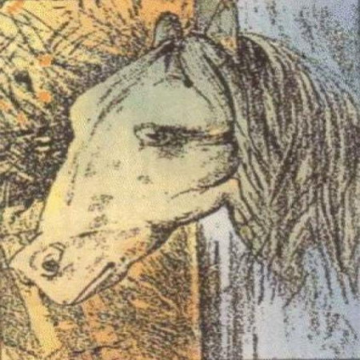

# Horse_or_Frog
Python code to submit rotated images to the Google Cloud Vision API + R code for visualizing it and determining whether it's a Horse or a Frog 

All tools used:

* Python to rotate the image and get predictions from the API for each rotation.
* R, ggplot2, gganimate for building the animations.
* ffmpeg to render the animations.
* A video editor to stitch all the animations together.

**Disclaimer**: This was my first time working with gganimate (and working around a few bugs which surfaced), as a result my R code is messier than my typical R code.

Result:
Check out HorseorFrog.mp4
